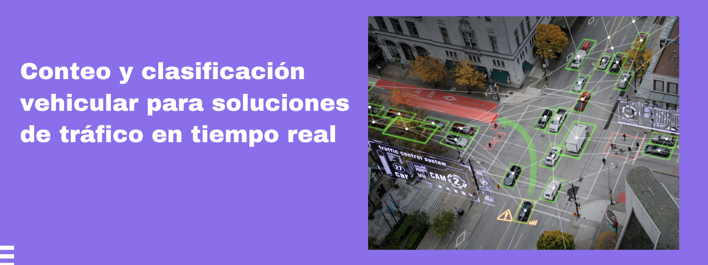
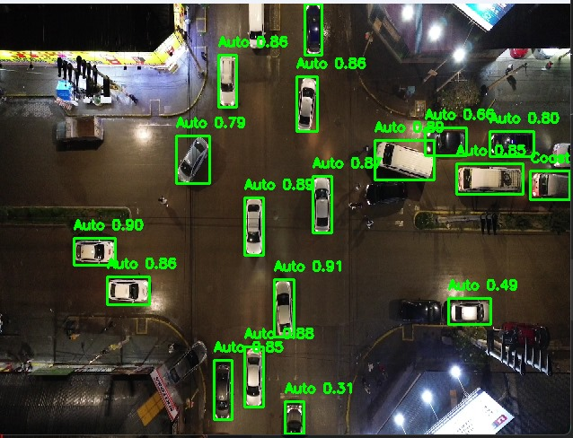
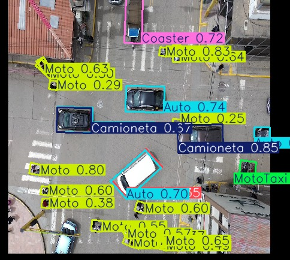

# Sistema de Análisis de Tráfico Vehicular Inteligente



Sistema avanzado de monitoreo y análisis de tráfico vehicular en tiempo real que utiliza visión por computadora e inteligencia artificial para el conteo y seguimiento de vehículos en diferentes segmentos viales.

## 🚀 Características Principales

- 🚗 **Detección en Tiempo Real**: Utiliza YOLOv8 para la detección precisa de vehículos.
- 📍 **Seguimiento de Objetos**: Implementa ByteTrack para el seguimiento consistente de vehículos entre fotogramas.
- 🛣️ **Análisis por Segmentos**: Permite definir múltiples segmentos de carretera para análisis independiente.
- 📊 **Estadísticas en Tiempo Real**: Muestra conteos y métricas de tráfico actualizadas.
- 💾 **Exportación de Datos**: Guarda los resultados en formato CSV para análisis posteriores.

## 📸 Demostración Visual

### Primera Versión: Detección Básica

*Primera versión mostrando la detección básica de vehículos.*

### Versión Final: Sistema Completo

*Versión final con seguimiento, conteo y análisis de direcciones.*

## 🛠️ Requisitos Técnicos

- Python 3.8 o superior
- OpenCV
- Ultralytics YOLOv8
- PyTorch
- Numpy
- Pandas

## 🚀 Instalación

1. Clona el repositorio:
```bash
git clone https://github.com/Joshue-24/Vehicle-Traffic-Analysis.git
cd Vehicle-Traffic-Analysis
```

2. Instala las dependencias:
```bash
pip install ultralytics opencv-python numpy pandas
```

## 🏃‍♂️ Uso

1. Ejecuta el script principal:
```bash
python TRAKING32.py
```

2. Configura los parámetros en el código según sea necesario:
   - Ajusta `modelo.conf` para cambiar el umbral de confianza (0-1)
   - Modifica `modelo.iou` para ajustar la intersección sobre unión
   - Personaliza los segmentos de análisis en el código

## 📁 Estructura del Proyecto

```
Vehicle-Traffic-Analysis/
├── TRAKING32.py       # Script principal de análisis de tráfico
├── 4 segmentos.py     # Versión con 4 puntos de segmentación
├── best.pt           # Modelo YOLOv8 pre-entrenado
├── bytetrack.yaml     # Configuración del tracker
├── detec/            # Módulos de detección
├── Trafic_1.png      # Imagen de portada
├── trafic_2.jpeg     # Captura del sistema completo
└── trafic_3.jpeg     # Captura de la primera versión
```

## 📊 Salida

El sistema genera un archivo CSV con las siguientes métricas por vehículo detectado:
- ID del vehículo
- Coordenadas (x, y)
- Velocidad estimada
- Dirección de movimiento
- Timestamp
- Segmento de carretera

## 🤝 Contribución

¡Las contribuciones son bienvenidas! Por favor, abre un issue para discutir los cambios que te gustaría realizar.

## 📄 Licencia

Este proyecto está bajo la Licencia MIT. Ver el archivo `LICENSE` para más detalles.

## ✉️ Contacto

Para consultas o soporte, por favor abre un issue en el repositorio.
